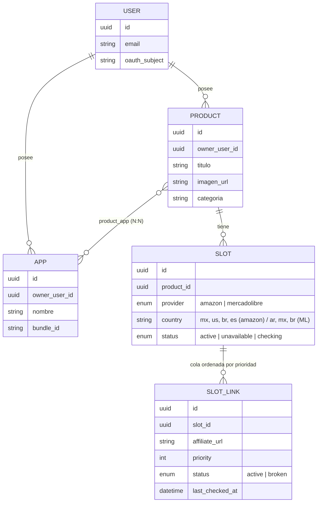
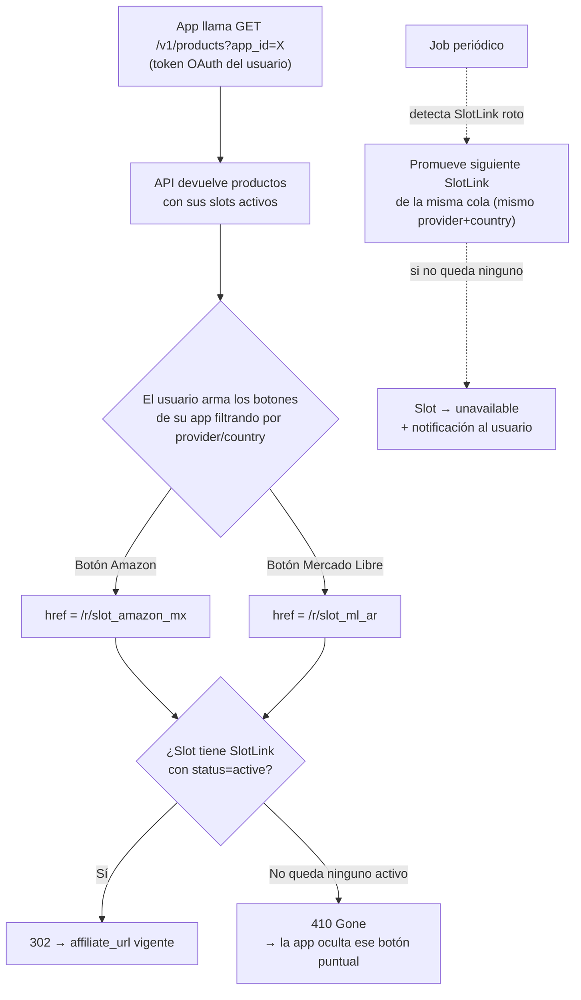

# Solución final — API de links referidos

## 1. Validación de la idea original (v2)

La primera versión de este documento asumía que el "slot" era un hueco fijo dentro de una app (`despertador:libro-recomendado`). Los nuevos requerimientos cambian el eje del modelo: **el slot ahora es una propiedad del producto**, no de la app — un producto tiene un slot por cada canal donde existe (Amazon MX, Amazon US, Mercado Libre AR, etc.), y son las apps las que consultan productos filtrando por sí mismas y arman sus propios botones eligiendo qué slot usar. Este documento reemplaza el modelo anterior.

Puntos nuevos que agrega el usuario y cómo se resuelven:

| Requerimiento | Resolución en el modelo |
|---|---|
| Acceso por OAuth, cada usuario ve solo su entorno | Todo recurso (`App`, `Product`) pertenece a un `owner_user_id`; el token OAuth trae ese `user_id` y todas las queries se filtran automáticamente por él |
| Un producto puede estar en más de una app | Relación N:N `Product ↔ App` |
| Un producto puede estar en Amazon, Mercado Libre o ambos; Amazon se divide por país | El producto tiene N `Slot`, cada uno con `provider` (amazon/mercadolibre) + `country` |
| Filtrar productos por app | `GET /v1/products?app_id=...` |
| Filtrar links de Amazon por país | `GET /v1/products/{id}/slots?provider=amazon&country=mx` |
| Producto visible si tiene algún link disponible (Amazon o ML) | El producto es visible si tiene ≥1 `Slot` con `status = active`, sin importar cuál |
| Usuario arma sus propios botones (uno por Amazon, uno por ML) | La API expone los slots ya separados por provider/country; el `cta_url` de cada slot es independiente, el usuario decide qué slot usa en qué botón dentro de su app |
| Slot: si el link no funciona, pasa al próximo | Cada `Slot` tiene una cola ordenada de `SlotLink` (candidatos); si el vigente falla, se promueve el siguiente de la misma cola (mismo provider+country) |
| Si no hay links disponibles, debe devolver un status code | `GET /r/{slot_id}` devuelve `410 Gone` cuando el slot no tiene ningún `SlotLink` activo |

## 2. Modelo de datos

```
User          (id, email, oauth_subject)
App           (id, owner_user_id, nombre, bundle_id/dominio, activo)
Product       (id, owner_user_id, titulo[80], descripcion_corta[160],
               descripcion_larga[500]?, imagen_url, imagen_alt[125]?,
               categoria[40])
ProductApp    (product_id, app_id)                       -- N:N producto↔app
Slot          (id, product_id, provider [amazon|mercadolibre],
               country,  -- amazon: us/mx/br/es/... (marketplaces reales, ver doc 2)
                         -- mercadolibre: ar/mx/br/... (sitio ML del país)
               status [active|unavailable|checking])
SlotLink      (id, slot_id, affiliate_url, priority, status [active|broken],
               last_checked_at, last_ok_at)
CheckLog      (id, slot_link_id, checked_at, resultado, detalle)
```

Notas clave:
- **`Slot` = producto + proveedor + país.** Un mismo producto puede tener, por ejemplo, 4 slots simultáneos: `amazon:mx`, `amazon:us`, `mercadolibre:ar`, `mercadolibre:mx`.
- **`SlotLink` es la cola interna de un slot.** No se "edita" el link de un slot — se agregan `SlotLink` con prioridad, y el slot siempre sirve el de mayor prioridad con `status = active`. Esto es lo que resuelve "si el link no funciona pasa al próximo" sin mezclar proveedores entre sí (a diferencia de la v1 de este documento, acá el fallback es *dentro* del mismo canal, no salta de Amazon a Mercado Libre automáticamente — ese salto lo decide el usuario mostrando/ocultando botones según qué slots estén activos).
- Un `Slot` sin ningún `SlotLink` activo pasa a `status = unavailable`. El producto sigue existiendo y sigue siendo consultable mientras tenga **al menos un** slot activo entre todos los suyos.
- **Un slot nuevo arranca en `status = active` (default optimista):** se asume que el admin cargó un link que ya probó a mano; recién el verificador periódico (§5) lo degrada a `unavailable` si más adelante deja de funcionar. La alternativa (arrancar en un estado intermedio tipo `checking` hasta la primera corrida del verificador) deja el slot invisible para las apps hasta la próxima corrida del job, sin ganar nada a cambio — se descartó tras probarlo.

### 2.1 Límites de longitud en los campos de producto

El problema concreto que resuelve esto: un mismo `Product` puede consultarse desde dos apps con layouts distintos (una tarjeta angosta en `training-app`, una tarjeta ancha en `despertador-app`). Si el título o la descripción no tienen un tope, cada app termina resolviendo el desface de forma distinta (una trunca con `...`, otra hace wrap a 3 líneas, otra rompe el layout) — el mismo dato se ve "roto" en un lugar y bien en otro. La solución es fijar el límite **en el modelo, del lado de la API**, no dejarlo librado a cada app:

| Campo | Límite | Justificación |
|---|---|---|
| `titulo` | 80 caracteres | Entra en una sola línea de card en la mayoría de anchos de pantalla mobile; es el mismo orden de magnitud que un `<title>` de SEO. |
| `descripcion_corta` | 160 caracteres | Pensado para 2-3 líneas de card. Mismo largo que una meta description — ya viene "pre-probado" como longitud que se lee bien en espacios chicos. |
| `descripcion_larga` (opcional) | 500 caracteres | Solo para apps que tengan una vista de detalle del producto; no se usa en la tarjeta. |
| `imagen_alt` (opcional) | 125 caracteres | Convención estándar de accesibilidad para `alt` text. |
| `categoria` | 40 caracteres | Uso interno de filtrado, no se muestra prominente. |

Reglas adicionales:
- **Los campos de texto son texto plano, sin HTML ni Markdown.** Si se permitiera formato, dos apps con soporte de renderizado distinto (una interpreta Markdown, otra no) volverían a generar el mismo tipo de desface que se busca evitar con los límites de longitud.
- **La validación ocurre al escribir, no al leer.** El endpoint de alta/edición de producto (usado por el panel) rechaza con `422` cualquier campo que exceda su límite — así la garantía es "todo lo que devuelve la API ya cumple el límite", y ninguna app consumidora necesita truncar defensivamente (aunque hacerlo con `text-overflow: ellipsis` como resguardo extra no está de más).
- Estos límites son **por producto**, no por app: se definió el número pensando en el caso más chico (mobile), para que sirva razonablemente bien en cualquier layout más grande. Si en el futuro una app puntual necesitara un texto distinto al mismo producto (ej. una versión todavía más corta), la extensión natural sería agregar un override opcional en `ProductApp` (`titulo_override`) — no está en esta versión porque no hay un caso real que lo necesite todavía.

## 3. Autenticación y aislamiento por entorno

**Decisión para esta versión: arranca single-tenant.** Confirmado que por ahora hay un solo usuario real (vos) administrando todas las apps, así que implementar el flujo OAuth completo (Client Credentials, emisión de tokens, etc.) sería complejidad sin beneficio inmediato. Se resuelve así:

- **v1 (ahora):** autenticación con una **API key estática** (un solo secreto, generado una vez, usado en el header `Authorization`). No hay noción real de "múltiples entornos" corriendo todavía.
- **El modelo de datos sí conserva `owner_user_id`** en `App` y `Product` desde el día uno, apuntando a una única fila `User` fija (la tuya). Esto es deliberado: agregar esa columna después, con datos ya cargados, es una migración incómoda (hay que retro-completarla en cada fila existente); dejarla desde el principio con un solo valor posible cuesta cero y evita ese trabajo futuro.
- **Migración a multi-tenant (cuando escale):** el día que haga falta un segundo entorno real, el cambio es solo en la capa de autenticación — reemplazar la API key estática por el flujo OAuth2 Client Credentials descrito en la v1 de este documento (emitir JWT con `sub=user_id`, permitir múltiples filas en `User`, exponer un alta de usuario/cliente). El modelo de datos (`App`, `Product`, `Slot`, `SlotLink`) no cambia — ya está preparado para filtrar por `owner_user_id` en cada query desde ahora, aunque hoy ese filtro siempre resuelva al mismo usuario. Esto queda documentado como deuda técnica planeada, no como algo a construir ahora (ver `04-alcance-y-limitaciones.md`).

## 4. Endpoints

**Listar productos de una app, con sus slots:**
```
GET /v1/products?app_id={app_id}
Authorization: Bearer <api_key>   -- v1: API key estática. Ver §3 para el plan de migración a OAuth.

→ [{
     id, titulo, imagen_url,
     slots: [
       { slot_id, provider: "amazon", country: "mx", status: "active", cta_url: "/r/slot_abc" },
       { slot_id, provider: "mercadolibre", country: "ar", status: "active", cta_url: "/r/slot_def" }
     ]
   }, ...]
```
Solo devuelve productos con `owner_user_id = token.sub` y asociados a ese `app_id` (vía `ProductApp`). Por defecto solo incluye slots con `status = active`, pero admite `?include_unavailable=true` para el panel de admin.

**Filtrar slots de un producto puntual (para armar un botón específico):**
```
GET /v1/products/{product_id}/slots?provider=amazon&country=mx
GET /v1/products/{product_id}/slots?provider=mercadolibre
```
Así el usuario arma en su app "un botón de Amazon" y "un botón de Mercado Libre" con una sola llamada filtrada cada uno, sin tener que parsear todo el array.

**Redirección (lo que va en el `href` del botón):**
```
GET /r/{slot_id}
→ 302 a la affiliate_url del SlotLink activo de mayor prioridad
→ 410 Gone si el slot no tiene ningún SlotLink activo
```
El redirect **no** valida el link en el momento del click (eso sería lento y machacaría a Amazon/ML por cada click real). Confía en el último estado calculado por el verificador periódico (doc 1 §5). El código 410 (no 404) se elige deliberadamente: significa "existió y ya no está disponible", útil para que la app decida ocultar el botón en vez de tratarlo como un error genérico.

## 5. Verificador de disponibilidad (sin cambios de fondo respecto a v1)

Corre periódicamente por cada `SlotLink` con `status = active`:
- **Mercado Libre:** `GET api.mercadolibre.com/items/{item_id}` (extraído de la URL), revisa `status`.
- **Amazon:** vía Creators API si la cuenta tiene acceso (ver doc 2/4 — limitación real al arrancar), o señal débil de HTTP como alerta.
- Si un `SlotLink` falla de forma sostenida (no en el primer intento, para evitar falsos positivos), pasa a `broken` y se promueve el siguiente `SlotLink` del mismo `Slot`. Si no queda ninguno, el `Slot` completo pasa a `unavailable` y se dispara una notificación al usuario.

## 6. Diagrama — estructura de datos



## 7. Diagrama — flujo de consumo y fallback



## 8. Qué decide el usuario vs. qué decide la API

Para que quede explícito, porque es la parte que "corre por parte de él" (como aclaraste):

- **La API decide:** si un slot está disponible o no, y a qué URL redirige en cada momento.
- **El usuario decide:** qué slots existen para cada producto (cuántos países/proveedores carga), y qué botón de su app usa cada slot. La API nunca elige automáticamente "mostrar Amazon en vez de Mercado Libre" — solo informa qué está disponible; la composición visual y la prioridad entre proveedores queda del lado de la app consumidora.
