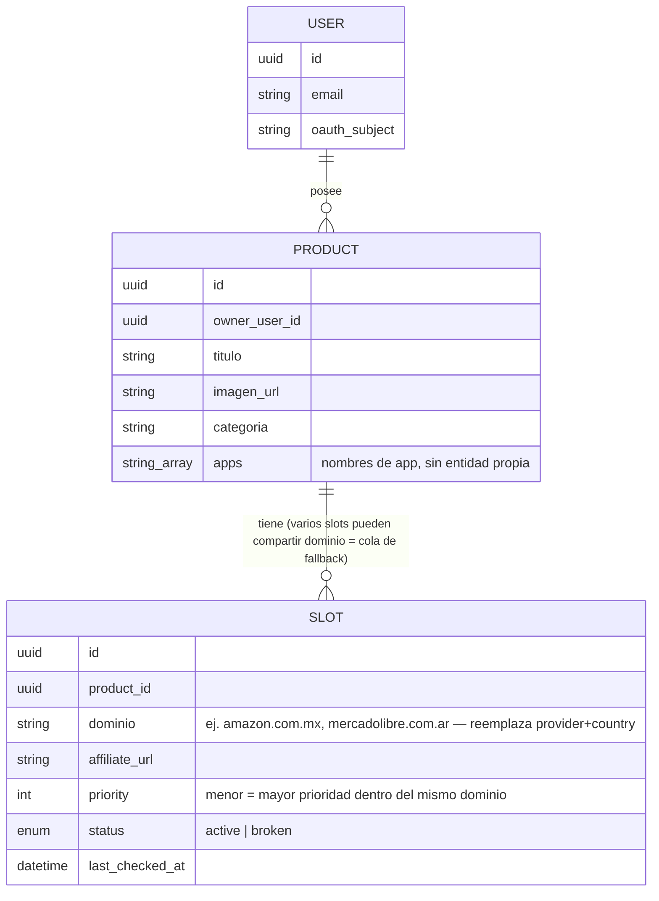
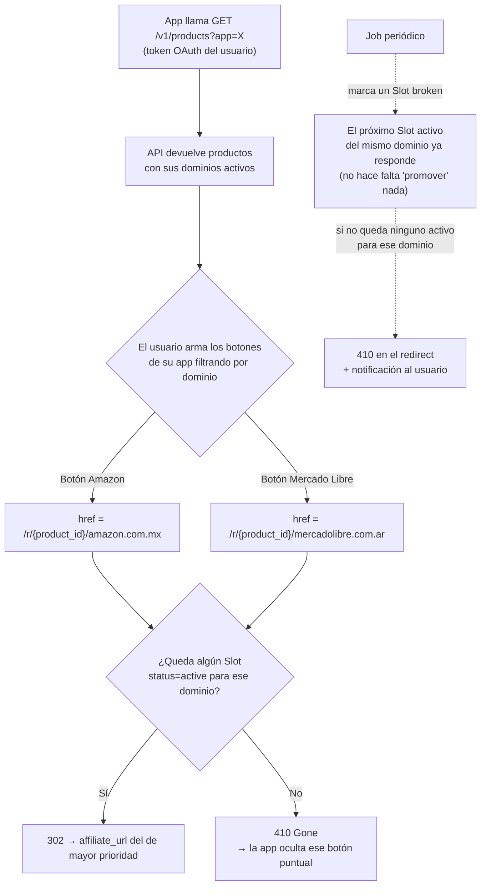

# Solución final — API de links referidos

## 1. Validación de la idea original (v2)

La primera versión de este documento asumía que el "slot" era un hueco fijo dentro de una app (`despertador:libro-recomendado`). Los nuevos requerimientos cambian el eje del modelo: **el slot ahora es una propiedad del producto**, no de la app — un producto tiene un slot por cada canal donde existe (Amazon MX, Amazon US, Mercado Libre AR, etc.), y son las apps las que consultan productos filtrando por sí mismas y arman sus propios botones eligiendo qué slot usar. Este documento reemplaza el modelo anterior.

Puntos nuevos que agrega el usuario y cómo se resuelven:

| Requerimiento | Resolución en el modelo |
|---|---|
| Acceso por OAuth, cada usuario ve solo su entorno | Todo recurso (`Product`) pertenece a un `owner_user_id`; el token OAuth trae ese `user_id` y todas las queries se filtran automáticamente por él |
| Un producto puede estar en más de una app | `Product.apps` es un array de nombres — no hay entidad `App` propia (ver nota en §2) |
| Un producto puede estar en Amazon, Mercado Libre o ambos; Amazon se divide por país | El producto tiene N `Slot`, cada uno con un `dominio` (ej. `amazon.com.mx`, `mercadolibre.com.ar` — fusiona proveedor+país, ver §2) |
| Filtrar productos por app | `GET /v1/products?app=nombre` |
| Filtrar links de Amazon por país | `GET /v1/products/{id}/slots?dominio=amazon.com.mx` |
| Producto visible si tiene algún link disponible (Amazon o ML) | El producto es visible si tiene ≥1 `Slot` con `status = active` en cualquier dominio |
| Usuario arma sus propios botones (uno por Amazon, uno por ML) | La API expone los dominios ya agrupados; el `cta_url` de cada dominio es independiente, el usuario decide qué dominio usa en qué botón dentro de su app |
| Slot: si el link no funciona, pasa al próximo | Un `Slot` es un único link + prioridad; varios `Slot` pueden compartir el mismo `dominio` — forman la cola de fallback de ese canal, ordenada por `priority` |
| Si no hay links disponibles, debe devolver un status code | `GET /r/{product_id}/{dominio}` devuelve `410 Gone` cuando ese dominio no tiene ningún `Slot` activo |

## 2. Modelo de datos

```
User          (id, email, oauth_subject)
Product       (id, owner_user_id, titulo[80], descripcion_corta[160],
               descripcion_larga[500]?, imagen_url, imagen_alt[125]?,
               categoria[40], apps[])
Slot          (id, product_id, dominio, affiliate_url, priority,
               status [active|broken], last_checked_at, last_ok_at)
CheckLog      (id, slot_id, checked_at, resultado, detalle)
```

Notas clave:
- **No hay entidad `App` separada.** De una app solo hace falta el nombre para identificarla (funciona como su propio id), así que "en qué apps se muestra un producto" es directamente un atributo del producto (`apps`, un array de nombres) en vez de una tabla `App` + join N:N `ProductApp`. Sigue siendo N:N en la práctica (un producto puede listar varias apps), solo que sin una tabla intermedia — a esta escala (unas pocas apps por usuario) es una simplificación real, no una pérdida de capacidad. `GET /v1/products?app=nombre` filtra por ese array.
- **`Slot` = un único link + prioridad.** Ya no es "canal + cola de candidatos" en dos tablas — cada fila de `Slot` es directamente un link candidato. Varias filas pueden compartir el mismo `product_id` + `dominio`: esas filas *son* la cola de fallback de ese canal, ordenada por `priority` (menor número = mayor prioridad). No hace falta una tabla intermedia para expresar "candidatos de un mismo canal" — el propio `dominio` repetido cumple ese rol, y el `redirect` (§4) resuelve "cuál sirvo ahora" con un simple `WHERE product_id=X AND dominio=Y AND status='active' ORDER BY priority LIMIT 1`.
- **`dominio` reemplaza `provider` + `country`.** En vez de dos campos (`provider: amazon|mercadolibre`, `country: mx|us|ar...`), un solo campo con el dominio real del canal (`amazon.com.mx`, `amazon.com`, `mercadolibre.com.ar`, `mercadolibre.com.mx`...). Es más directo — cada canal ya *es* un dominio real — y evita cargar dos atributos para expresar una sola cosa. El proveedor (para decidir la estrategia de verificación, ver §5) se infiere del propio string (`dominio.includes("mercadolibre")`) en vez de guardarse aparte.
- **No hay `status = unavailable` a nivel de fila.** Cada `Slot` es `active` o `broken` (es un link puntual, no un canal). "Este dominio no tiene nada disponible" es un estado *agregado*, calculado al leer (¿queda algún `Slot` `active` para ese `product_id` + `dominio`?), no algo que se guarda — evita mantener dos fuentes de verdad sincronizadas.
- **Un slot nuevo arranca en `status = active` (default optimista):** se asume que el admin cargó un link que ya probó a mano; recién el verificador periódico (§5) lo degrada a `broken` si más adelante deja de funcionar. La alternativa (arrancar en un estado intermedio tipo `checking` hasta la primera corrida del verificador) deja el slot invisible para las apps hasta la próxima corrida del job, sin ganar nada a cambio — se descartó tras probarlo.

### 2.1 Límites de longitud en los campos de producto

El problema concreto que resuelve esto: un mismo `Product` puede consultarse desde dos apps con layouts distintos (una tarjeta angosta en `training-app`, una tarjeta ancha en `despertador-app`). Si el título o la descripción no tienen un tope, cada app termina resolviendo el desface de forma distinta (una trunca con `...`, otra hace wrap a 3 líneas, otra rompe el layout) — el mismo dato se ve "roto" en un lugar y bien en otro. La solución es fijar el límite **en el modelo, del lado de la API**, no dejarlo librado a cada app:

| Campo | Límite | Justificación |
|---|---|---|
| `titulo` | 80 caracteres | Entra en una sola línea de card en la mayoría de anchos de pantalla mobile; es el mismo orden de magnitud que un `<title>` de SEO. |
| `descripcion_corta` | 160 caracteres | Pensado para 2-3 líneas de card. Mismo largo que una meta description — ya viene "pre-probado" como longitud que se lee bien en espacios chicos. |
| `descripcion_larga` (opcional) | 500 caracteres | Solo para apps que tengan una vista de detalle del producto; no se usa en la tarjeta. |
| `imagen_alt` (opcional) | 125 caracteres | Convención estándar de accesibilidad para `alt` text. |
| `categoria` | 40 caracteres | Uso interno de filtrado, no se muestra prominente. |

Reglas adicionales:
- **Los campos de texto son texto plano, sin HTML ni Markdown.** Si se permitiera formato, dos apps con soporte de renderizado distinto (una interpreta Markdown, otra no) volverían a generar el mismo tipo de desface que se busca evitar con los límites de longitud.
- **La validación ocurre al escribir, no al leer.** El endpoint de alta/edición de producto (usado por el panel) rechaza con `422` cualquier campo que exceda su límite — así la garantía es "todo lo que devuelve la API ya cumple el límite", y ninguna app consumidora necesita truncar defensivamente (aunque hacerlo con `text-overflow: ellipsis` como resguardo extra no está de más).
- Estos límites son **por producto**, no por app: se definió el número pensando en el caso más chico (mobile), para que sirva razonablemente bien en cualquier layout más grande. Si en el futuro una app puntual necesitara un texto distinto al mismo producto (ej. una versión todavía más corta), la extensión natural sería agregar un campo opcional tipo `titulo_override` — no está en esta versión porque no hay un caso real que lo necesite todavía.

### 2.2 Reglas de prioridad dentro de un dominio

- **Única solo entre slots activos.** El índice único es `(product_id, dominio, priority) WHERE status = 'active'` — no sobre todas las filas. Un slot `broken` no "reserva" su número para siempre: apenas deja de contar, un candidato nuevo puede reusar esa misma prioridad sin conflicto. Antes de este cambio la unicidad era global, y un slot roto bloqueaba ese número indefinidamente aunque ya no compitiera por nada.
- **No hace falta que la secuencia sea densa.** Cuando un slot se rompe, se queda con su número tal cual (no se renumeran los demás) — el redirect (§4) siempre resuelve "cuál sirvo ahora" con `ORDER BY priority ASC LIMIT 1 WHERE status='active'`, que funciona igual de bien con huecos (0, 2, 7) que con una secuencia perfecta (0, 1, 2). Renumerar en cada rotura significaría updates en cadena sobre el resto de la cola en cada corrida del verificador, y volvería inestable un número que alguien puede estar mirando en el panel — complejidad real sin ninguna ganancia funcional.
- **Insertar-y-empujar, no error, si se pide una prioridad activa ya ocupada.** Si al crear o editar un slot se indica una prioridad que ya tiene otro slot *activo* del mismo dominio, en vez de devolver `409` el sistema corre un lugar a ese y a los siguientes de la cola (todos +1, empezando por el de mayor número para no chocar consigo mismos a mitad de camino). Sin prioridad explícita, se sigue asignando automáticamente "el último de la cola" (`max` de todo lo que existió alguna vez en ese dominio + 1, activo o roto — para que un número de prioridad nunca quede referido a dos links distintos con el tiempo).
- **Caso límite: un slot roto que se autorepara puede encontrar su lugar viejo ocupado.** Si mientras estaba `broken` otro slot activo tomó su misma prioridad, al volver a `active` no puede reclamar ese número — se le asigna uno nuevo al final de la cola en vez de romper el índice único.

## 3. Autenticación y aislamiento por entorno

**Multi-tenant implementado, aunque hoy solo exista un tenant real (vos).** Se adelantó la migración documentada originalmente para "cuando escale" — no porque ya haya un segundo usuario, sino para no tener que tocar la capa de auth más adelante bajo presión. Auth por **email + contraseña**, un solo registro que sirve para las dos formas de usar el sistema:

- **`POST /auth/register`** (email, password) crea la cuenta y devuelve un access token. **`POST /auth/login`** hace lo mismo para una cuenta existente. La contraseña se guarda hasheada con scrypt (`auth/password.ts`), nunca en texto plano.
- **Ese JWT es para sesiones humanas, no para integraciones de larga vida.** El dashboard lo guarda en una cookie httpOnly (`apps/dashboard/app/api/session/route.ts`) tras el login/registro, y protege `/admin/*` (`plugins/requireAuth.ts`). Vence a los 30 días (`auth/jwt.ts`) — pensado para que un humano vuelva a loguearse de vez en cuando, no para un servidor que corre solo.
- **`/v1/*` (lectura, consumida por las apps) usa una credencial aparte: una read API key.** Problema real que resuelve: una app (`training-app`, `despertador-app`) se integra una vez contra `GET /v1/products` y necesita que siga funcionando indefinidamente — un JWT de 30 días la rompería sin re-login, y no hay humano ahí para volver a loguearse. La key se genera desde el dashboard (`POST /admin/api-keys`, requiere sesión — es la parte que sí necesita estar logueado: elegir a qué cuenta pertenece) y no expira sola, solo si se revoca (`DELETE /admin/api-keys/{id}`). Se guarda solo su hash SHA-256 (`auth/readKey.ts`) — a diferencia de las contraseñas no lleva salt, porque nace con entropía alta y necesita poder buscarse por igualdad directa en la tabla. El hook `requireReadKey` (`plugins/requireReadKey.ts`) la valida y resuelve `request.userId` igual que `requireAuth`, pero **una read key no sirve en `/admin/*` y el JWT de sesión ya no sirve en `/v1/*`** — son credenciales separadas para usos separados, verificado en vivo.
- **Aislamiento:** cada endpoint filtra por `owner_user_id = request.userId`, sin importar si ese `userId` vino del JWT o de una read key — el `Product`/`Slot` de una cuenta nunca aparece en las queries de otra. Verificado en vivo: dos cuentas registradas por separado no se ven entre sí.
- **`/internal/check`** (el que dispara el cron) usa una tercera credencial totalmente aparte, `INTERNAL_KEY` (`plugins/requireInternalKey.ts`) — no tiene sentido detrás de un login humano, es un secreto de infraestructura fijo.
- **No hay dashboard multi-usuario para administrar cuentas ajenas:** cada quien administra únicamente lo suyo, entrando con su propio login — no existe un rol "root" que vea o gestione las cuentas de otros.

## 4. Endpoints

**Listar productos de una app, con sus dominios:**
```
GET /v1/products?app={nombre}
Authorization: Bearer <api_key>   -- v1: API key estática. Ver §3 para el plan de migración a OAuth.

→ [{
     id, titulo, imagen_url,
     slots: [
       { dominio: "amazon.com.mx", status: "active", cta_url: "/r/{product_id}/amazon.com.mx" },
       { dominio: "mercadolibre.com.ar", status: "active", cta_url: "/r/{product_id}/mercadolibre.com.ar" }
     ]
   }, ...]
```
Solo devuelve productos con `owner_user_id = token.sub` cuyo array `apps` incluya ese `nombre`. Los `Slot` (candidatos) de cada producto se agrupan por `dominio`: cada entrada de `slots` es un dominio, con `status = "active"` si le queda al menos un `Slot` activo. Por defecto solo incluye dominios activos, pero admite `?include_unavailable=true` para el panel de admin.

**Filtrar dominios de un producto puntual (para armar un botón específico):**
```
GET /v1/products/{product_id}/slots?dominio=amazon.com.mx
```
Así el usuario arma en su app "un botón de Amazon" y "un botón de Mercado Libre" con una sola llamada filtrada cada uno, sin tener que parsear todo el array.

**Redirección (lo que va en el `href` del botón):**
```
GET /r/{product_id}/{dominio}
→ 302 a la affiliate_url del Slot activo de mayor prioridad para ese dominio
→ 410 Gone si ese dominio no tiene ningún Slot activo
```
La clave es `product_id` + `dominio`, no el id de un `Slot` puntual — así la URL del botón queda estable en el tiempo aunque el candidato "vigente" cambie (se rompa uno y se promueva el siguiente de la cola). El redirect **no** valida el link en el momento del click (eso sería lento y machacaría a Amazon/ML por cada click real). Confía en el último estado calculado por el verificador periódico (§5). El código 410 (no 404) se elige deliberadamente: significa "existió y ya no está disponible", útil para que la app decida ocultar el botón en vez de tratarlo como un error genérico.

## 5. Verificador de disponibilidad

Corre periódicamente por cada `Slot` con `status = active`:
- **Mercado Libre** (`dominio` contiene "mercadolibre"): `GET api.mercadolibre.com/items/{item_id}` (extraído de la URL), revisa `status`.
- **Amazon** (o Mercado Libre cuando no se pudo extraer el item_id de la URL): vía Creators API si la cuenta tiene acceso (ver doc 2/4 — limitación real al arrancar), o señal débil de HTTP como alerta.
- Si un `Slot` falla de forma sostenida (no en el primer intento, para evitar falsos positivos), pasa a `broken`. Como el fallback ya no es una promoción explícita sino simplemente "el próximo `Slot` activo del mismo dominio, ordenado por priority", no hace falta ningún paso adicional para que tome su lugar. Si tras eso no queda ningún `Slot` activo para ese `product_id` + `dominio`, se dispara una notificación al usuario.

## 6. Diagrama — estructura de datos



## 7. Diagrama — flujo de consumo y fallback



## 8. Qué decide el usuario vs. qué decide la API

Para que quede explícito, porque es la parte que "corre por parte de él" (como aclaraste):

- **La API decide:** si un slot está disponible o no, y a qué URL redirige en cada momento.
- **El usuario decide:** qué dominios existen para cada producto (cuántos países/proveedores carga) y con qué prioridad dentro de cada uno, y qué botón de su app usa cada dominio. La API nunca elige automáticamente "mostrar Amazon en vez de Mercado Libre" — solo informa qué está disponible; la composición visual y la prioridad entre proveedores queda del lado de la app consumidora.
